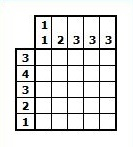

# NONOGRAM Solver

## Usage

Enter the values one by one starting from the left side, reading from left to right going down,
then move to the top section and read from top to botton going right.

Looking at the example above the input would be:  
Left: 34321  
Top: 112333  
Complete input: 34321112333
